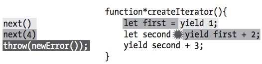
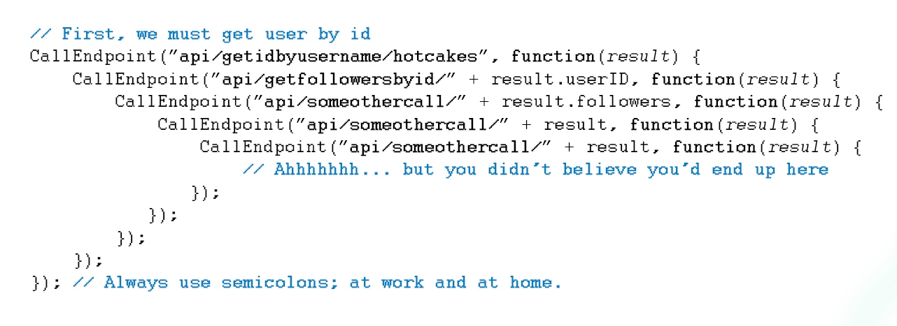

# 8.2  generator 高级用法

这节介绍在复杂场景下， `generator` 的一些用法。结尾会介绍如何利用 `generator`，用同步的写法，写异步代码。

## 1. 传参 

简单说就是可以往`next`传参数，而`generator`里 `yield` 处可以接收到这个参数, 如下例子:


```
function *createIterator() {
  let first = yield 1;
  let second = yield first + 2;    // 4 + 2
  yield second + 3;                // 5 + 3
}
let iterator = createIterator();   
console.log(iterator.next());      // "{ value: 1, done: false }"
console.log(iterator.next(4));     // "{ value: 6, done: false }"
console.log(iterator.next(5));     // "{ value: 8, done: false }"
console.log(iterator.next());      // "{ value: undefined, done: true }"
```

### 执行流程

要很明白地解释上面的执行过程，可借助这张图:
	
	
	

	颜色相同的是同一次迭代里执行的，由浅到深，表示迭代的先后顺序。如:
	1. 第一次调用`next()`, 执行 `yield 1` 到停止，返回 `{ value: 1, done: false }`。**注意**，这时赋值语句 `let fisrt = ...` 没有执行;
	2. 第二次调用 `next(4)`， 先将参数 `4` 传入上一次 `yield` 处，可理解为：
	
		```
		let first = yield 1;
		
		=>
		
		let first = 4;
		```
		再从上次停顿的地方开始执行，就是说先执行赋值语句
		
		```
		let first = 4
		```
		然后执行到下个`yield`为止，即
		
		```
		yield first + 2  // 4 + 2
		```
		最后返回 `{ value: 6, done: false }`
		
		
		之后的 `next` 依上面的原理而执行，知道迭代完毕。
		
	也就是说，通过`next`的参数，`generator` 产生的 `iterator`，与外部环境搭建起了**沟通的桥梁**，结合 `iterator` 可以停顿的特点，可以做一些有意思的事，如用同步方式写回调等，详见下文。


## 2. 往 `iterator` 里抛错


```
function *createIterator() {
  let first = yield 1;
  let second = yield first + 2; // yield 4 + 2, 然后抛出错误
  yield second + 3;             // 不会被执行
}
let iterator = createIterator();
	
console.log(iterator.next());  // {value: 1, done: false}
console.log(iterator.next(4)); // {value: 6, done: false}
console.log(iterator.throw(new Error("Boom"))); // generator 里抛出的错误
```

根据上面说的执行机制，这里例子的执行流程可以用这张图表示：
	


	
第三次执行迭代时，我们调用 `iterator.throw(new Error("Boom"))`, 向 `iterator` 里抛出错误，传入的参数为错误信息。
	
我们可以改造 `createIterator` 如下：
	
	
```
function* createIterator() {
  let first = yield 1;
  let second;
  try {
    second = yield first + 2;
  } catch (ex) {
    second = 6;
  }
  yield second + 3;
}
let iterator = createIterator();                 
console.log(iterator.next());                   // "{ value: 1, done: false }"
console.log(iterator.next(4));                  // "{ value: 6, done: false }"
console.log(iterator.throw(new Error("Boom"))); // "{ value: 9, done: false }"
console.log(iterator.next());                   // "{ value: undefined, done: true }"
```

其执行流程解释如下:
	
1. 前两次调用 `next` 情况和执行机制里的分析是一样的，就不赘述了。
	
2. 第三次调用 `iterator.throw(new Error("Boom")` 往`generator` 往抛入错误，函数内部在上次停止处即 `yield first + 2` 接收信息，抛出错误。但是被`catch`了，所以继续执行到下一个停顿点:
	
	
	```
	yield second + 3;  // 6 + 3
	```
	最后返回本次迭代结果 `{ value: 9, done: false }`
	
3. 继续执行其他迭代，和上没无甚不同，不赘述。


> 	**小结：** 这里有可以看到，`next()` 和 `throw()` 都可以让 `iterator` 继续执行下去，不同的是后者会是以抛出错误的方式让 `iterator` 继续执行的。但在这之后，`generator` 里会发生什么，取决于代码怎么写的了。


## 3. `Generator` 里的 `return` 语
	
这里的 `return` 语句， 功能上与一般函数的 `return` 没太大区别，都会阻止 `return` 之后的语句执行。


```
function* createIterator() {
  yield 1;
  return;
  yield 2;
  yield 3;
}
let iterator = createIterator();
console.log(iterator.next());  // "{ value: 1, done: false }"
console.log(iterator.next());  // "{ value: undefined, done: true }"
```

上面的 `return`， 使得之后的 `yield` 都被忽略了，所以，迭代二次而卒。

但是，如果 `return` 后有值，会被计入本次迭代的结果中:

```
function* createIterator() {
  yield 1;
  return 42;
}
let iterator = createIterator();
console.log(iterator.next());  // "{ value: 1, done: false }"
console.log(iterator.next());  // "{ value: 42, done: true }"
console.log(iterator.next());  // "{ value: undefined, done: true }"
```

这个`iterator` 执行两次就可收摊了，和上一个例子不同的是，最后一次返回结果里有 `return` 后的值 `{ value: 42, done: true }`。

又但是，这个返回值只能用一次，所以第三次执行`next`, 返回结果变成了 `{ value: undefined, done: true }`。


**特别注意:** 展开操作符`...` 和 `for-of` 看到迭代结果里`done` 是 `true` 就马上停止执行，连 `return` 后面的值也不管了，停止得很决绝。如上面的例子，用`for-of` 和 `...` 执行:

```
function* createIterator() {
  yield 1;
  return 42;
}
let iterator = createIterator();


for(let item of iterator) {
  console.log(item);
}
// 1

let anotherIterator = createIterator();
console.log([...anotherIterator]) 
// [1]

// 猜猜 [...iterator] 的结果是什么
```


## 4. Generator 委托

`generator` 委托是什么，简单说就是把 `generator` A 委托给   `generator` B, 让 B 代为执行:

```
function* createNumberIterator() {
  yield 1;
  yield 2;
}
function* createColorIterator() {
  yield "red";
  yield "green";
}
function* createCombinedIterator() {
  yield* createNumberIterator();
  yield* createColorIterator();
  yield true;
}

var iterator = createCombinedIterator();

console.log(iterator.next()); // "{ value: 1, done: false }"
console.log(iterator.next()); // "{ value: 2, done: false }"
console.log(iterator.next()); // "{ value: "red", done: false }"
console.log(iterator.next()); // "{ value: "green", done: false }"
console.log(iterator.next()); // "{ value: true, done: false }"
console.log(iterator.next()); // "{ value: undefined, done: true }"
```

以上可见，委托的语法，就是在一个 `generator`里, 用 `yield*` 操作另一个 `generator` 的执行结果。

通过委托把不同的 `generator` 放一起，再利用`return` 的返回值，可以在 `generator` 里通信，给出了更多的想象空间:

```
function* createNumberIterator() {
  yield 1;
  yield 2;
  return 3;
}
function* createRepeatingIterator(count) {
  for (let i = 0; i < count; i++) {
    yield "repeat";
  }
}
function* createCombinedIterator() {
  let result = yield* createNumberIterator();
  yield* createRepeatingIterator(result);
}
var iterator = createCombinedIterator();
console.log(iterator.next()); // "{ value: 1, done: false }"
console.log(iterator.next()); // "{ value: 2, done: false }"
console.log(iterator.next()); // "{ value: "repeat", done: false }"
console.log(iterator.next()); // "{ value: "repeat", done: false }"
console.log(iterator.next()); // "{ value: "repeat", done: false }"
console.log(iterator.next()); // "{ value: undefined, done: true }"
``` 
如上, `createNumberIterator` 的返回值 `3` 传入了`createRepeatingIterator` 里， 如果拆开写，是这样：


```
function* createNumberIterator() {
  yield 1;
  yield 2;
  return 3;
}
function* createRepeatingIterator(count) {
  for (let i = 0; i < count; i++) {
    yield "repeat";
  }
}
function* createCombinedIterator() {
  let result = yield* createNumberIterator();
  yield result;
  yield* createRepeatingIterator(result);
}
var iterator = createCombinedIterator();
console.log(iterator.next());  // "{ value: 1, done: false }"
console.log(iterator.next());  // "{ value: 2, done: false }"
console.log(iterator.next());  // "{ value: 3, done: false }"
console.log(iterator.next());  // "{ value: "repeat", done: false }"
console.log(iterator.next());  // "{ value: "repeat", done: false }"
console.log(iterator.next());  // "{ value: "repeat", done: false }"
console.log(iterator.next());  // "{ value: undefined, done: true }"
```


> 注意：既然 `yield *` 后面接的是 `generator` 的执行结果，而 `generator` 是 `iterable`。就是说，`yield *` 后可以直接跟 `iterable`， 如字符串。如：

```
  let g = function *() {
    yield *['a', 'b', 'c']
  }

  for(let item of g()) {
    console.log(item);
  }
  
  // a
  // b
  // c
```

 

## 5. `Genarator` 与异步

关于 `js` 里异步的特点，这里展开说了。简单来讲，它让 `js` 这们单线程语言更强大; 但是，异步情况一复杂比如有异步之间有依赖，那就很容易写出如下的`callback hell`, 极难维护:



合理利用 `genarator` 就可以用同步的写法，写异步。


从之前的介绍里已经知道，`genarator` 返回 `iterator`, 需要手动调用 `next`, 很麻烦。那如果封装一些，可以让 `iterator` 自己执行完毕，不就很好了:

1. 前期准备，实现 自动执行 `generator` 的函数

	```
	run(function* () {
	  let value = yield 1;
	  console.log(value);
	  value = yield value + 3;
	  console.log(value);
	});
	```
	
	要让它自己执行，那么 `run` 需要:
	
	1. 执行 `generator`, 拿到 `iterator`;
	2. 调用 `iterator.next()`;
	3. 把上一步的返回结果作为下一次 `iterator.next(lastResult)` 参数，继续迭代;
	4. 重复 3 ，直到迭代完毕。
	
	
	实现如下:
	
	```
	function run(taskDef) {
	  
	  // 创建并保存 iterator，留到后面使用
	  let task = taskDef();
	  
	  let result = task.next();
	  
	  // 递归地执行 `next`
	  function step() {
	    // 如果没完的话
	    if (!result.done) {
	      result = task.next(result.value);
	      step();
	    }
	  }
	  // 开始处理
	  step();
	}
	```

2. 实现目标，用同步方式写异步

	加入我们要让下面这段代码可行:
	
	```
	const asyncWork = new Promise((resolve, reject) => {
	  setTimeout(() => resolve(5), 500)
	})
	
	
	run(function* () {
	  let value = yield asyncWork;
	  console.log(value)
	  value = yield value + 3;
	  console.log(value)
	});
	
	```
	
	这里和上一个例子不同的地方在于，`yield` 返回结果可能是个`promise`, 那我们加个判断就可以了:
	
	```
	if (result.value && typeof result.value.then === 'function') {
	  result.value.then(d => {
	    result = task.next(d)
	    ... 
	  })
	}
	```
	
	就是判断如果是 `promise`, 执行 `then` 函数，把返回结果传入下一次迭代 `next(d)` 即可。完整示例代码如下:
	
	```
	function run(taskDef) {
	  
	  // 创建并保存 iterator，留到后面使用
	  let task = taskDef();
	  
	  let result = task.next();
	  
	  // 递归地执行 `next`
	  function step() {
	    
	    // 如果没完的话
	    if (!result.done) {
	      if (result.value && typeof result.value.then === 'function') {
	        result.value.then(d => {
	          result = task.next(d)
	          step();
	        })
	      } else {
	        result = task.next(result.value);
	        step();
	      }
	    }
	  }
	  // 开始处理
	  step();
	}
	```
	
	回头看看这个写法:
	
	```
	run(function* () {
	  let value = yield asyncWork;
	  console.log(value)
	  value = yield value + 3;
	  console.log(value)
	});
	```
	
	虽然第二个 `yield` 对上一个 `yield` 结果有依赖，但不用写成回调，看着跟同步一样，很直白！
	
	
## 结语

`generator` 产生的 `iterator`， 可以用`next`，在函数外部往 `generator` 里传数据， 又可以通过 `throw` 往里抛错。它们相当于在 `generator` 里对外打开了多个通信窗口，这让清晰的异步成为可能，还有更多的玩法等待发掘。`ES6` 很强大！
	
	
	
	
	


